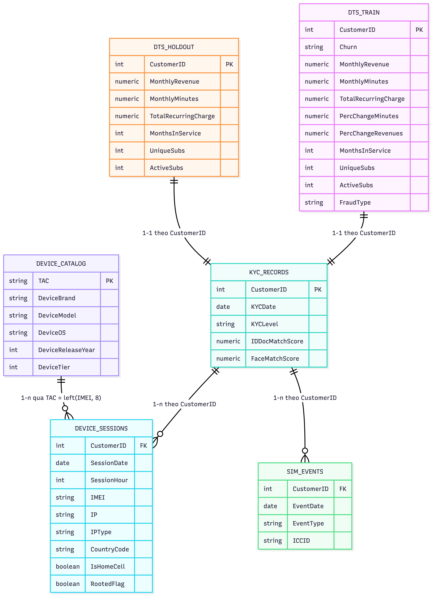

# Data Understanding

## 1. Tổng quan dữ liệu

Bộ dữ liệu trong thư mục `data/` gồm 6 bảng CSV:

| Bảng              |   Số dòng | Số cột | Vai trò                                                                 |
| ----------------- | --------: | -----: | ----------------------------------------------------------------------- |
| `dts_train`       |    51,047 |     60 | Bảng huấn luyện mức khách hàng, có nhãn `Churn` và cờ gian lận          |
| `dts_holdout`     |    20,000 |     57 | Bảng holdout mức khách hàng, không có `Churn`, `FraudFlag`, `FraudType` |
| `kyc_records`     |    71,047 |      5 | Hồ sơ KYC của khách hàng                                                |
| `device_sessions` | 1,276,727 |      9 | Nhật ký phiên thiết bị và mạng                                          |
| `sim_events`      |   101,755 |      4 | Sự kiện gắn với SIM/ICCID                                               |
| `device_catalog`  |        18 |      6 | Bảng tra cứu đặc tính thiết bị theo TAC                                 |

Tập `CustomerID` xuất hiện nhất quán trên `dts_train`, `dts_holdout`, `kyc_records`, `device_sessions`, `sim_events`. Tổng cộng có đúng `71,047` khách hàng duy nhất:

- `dts_train`: 51,047 khách hàng
- `dts_holdout`: 20,000 khách hàng
- `dts_train ∩ dts_holdout = 0`
- `dts_train ∪ dts_holdout = kyc_records = device_sessions = sim_events`

Điều này cho thấy `dts_train` và `dts_holdout` là hai lát cắt rời nhau của cùng một tập khách hàng gốc.

## 2. ERD logic

_Hình 1. ERD của bộ dữ liệu._

## 3. Quan hệ giữa các bảng

### 3.1. `kyc_records` và bảng khách hàng

- `kyc_records.CustomerID` là duy nhất: quan hệ `1-1` với bản ghi khách hàng.
- Mỗi `CustomerID` trong `dts_train` hoặc `dts_holdout` có đúng một hồ sơ KYC tương ứng.
- Có thể xem `kyc_records` là bảng gốc mức khách hàng, còn `dts_train` và `dts_holdout` là hai snapshot feature/label cho mô hình.

### 3.2. `kyc_records` và `device_sessions`

- Quan hệ `1-n` theo `CustomerID`.
- Mỗi khách hàng có nhiều phiên thiết bị theo ngày/giờ.
- `device_sessions` không có khóa chính tự nhiên ở mức dòng vì một khách hàng có thể có nhiều bản ghi cùng ngày.

Quan sát cardinality:

- 71,047 khách hàng xuất hiện trong `device_sessions`
- 5,818 khách hàng dùng hơn 1 `IMEI`
- Một `IMEI` có thể xuất hiện ở nhiều khách hàng
- Có 1,412 `IMEI` được chia sẻ bởi hơn 1 khách hàng

Suy ra:

- `CustomerID -> IMEI` là `1-n`
- `IMEI -> CustomerID` cũng có thể là `1-n`
- Về mặt nghiệp vụ, đây là quan hệ nhiều-nhiều giữa khách hàng và thiết bị, được materialize qua bảng `device_sessions`

### 3.3. `kyc_records` và `sim_events`

- Quan hệ `1-n` theo `CustomerID`.
- Mỗi khách hàng có thể có nhiều sự kiện SIM.

Quan sát cardinality:

- 20,399 khách hàng gắn với hơn 1 `ICCID`
- Tối đa 6 `ICCID` trên một khách hàng
- Mỗi `ICCID` chỉ thuộc về đúng 1 khách hàng trong dữ liệu hiện tại

Suy ra:

- `CustomerID -> ICCID` là `1-n`
- `ICCID -> CustomerID` là `n-1`

### 3.4. `device_catalog` và `device_sessions`

- `device_catalog.TAC` là khóa tra cứu duy nhất.
- `TAC` được suy ra từ 8 ký tự đầu của `device_sessions.IMEI`.
- Quan hệ `1-n`: một dòng catalog ánh xạ tới nhiều session.
- Toàn bộ `TAC` phát sinh từ `device_sessions` đều khớp với `device_catalog`:
  - 18/18 TAC khác nhau được map thành công
  - 0 dòng session bị thiếu mapping catalog

## 4. Mô tả từng bảng và thuộc tính

### 4.1. `dts_train`

Khóa:

- `CustomerID` là khóa chính logic

Thuộc tính chính:

- Nhãn mục tiêu:
  - `Churn`: `Yes/No`
- Doanh thu và sử dụng:
  - `MonthlyRevenue`, `MonthlyMinutes`, `TotalRecurringCharge`
  - `OverageMinutes`, `RoamingCalls`
  - `DroppedCalls`, `BlockedCalls`, `UnansweredCalls`
  - `ReceivedCalls`, `OutboundCalls`, `InboundCalls`
  - `PeakCallsInOut`, `OffPeakCallsInOut`
  - `CallForwardingCalls`, `CallWaitingCalls`
- Biến động:
  - `PercChangeMinutes`, `PercChangeRevenues`
- Vòng đời thuê bao:
  - `MonthsInService`, `UniqueSubs`, `ActiveSubs`
  - `CurrentEquipmentDays`
- Thiết bị và gói sử dụng:
  - `Handsets`, `HandsetModels`, `HandsetPrice`
  - `HandsetRefurbished`, `HandsetWebCapable`
  - `ServiceArea`
- Nhân khẩu học và hành vi:
  - `AgeHH1`, `AgeHH2`, `ChildrenInHH`
  - `Homeownership`, `IncomeGroup`, `Occupation`, `MaritalStatus`
  - `OwnsComputer`, `HasCreditCard`, `OwnsMotorcycle`, `TruckOwner`, `RVOwner`
  - `BuysViaMailOrder`, `RespondsToMailOffers`, `OptOutMailings`, `NonUSTravel`
- Chăm sóc giữ chân:
  - `RetentionCalls`, `RetentionOffersAccepted`, `MadeCallToRetentionTeam`
- Trạng thái khách hàng mới:
  - `NewCellphoneUser`, `NotNewCellphoneUser`
- Gian lận:
  - `FraudFlag`: `0/1`
  - `FraudType`: `device_farm`, `mule`, `none`, `sim_swap_ato`, `subscription_fraud`

Kiểu dữ liệu:

- `CustomerID`, `MonthsInService`, `UniqueSubs`, `ActiveSubs`, `RetentionCalls`, `RetentionOffersAccepted`, `IncomeGroup`, `AdjustmentsToCreditRating`: số nguyên
- Các cột đo lường cước/usage: số thực
- Các cột `Yes/No`, phân hạng và nghề nghiệp: chuỗi phân loại

### 4.2. `dts_holdout`

Khóa:

- `CustomerID` là khóa chính logic

Đặc điểm:

- Schema gần giống `dts_train`
- Không có các cột:
  - `Churn`
  - `FraudFlag`
  - `FraudType`

Vai trò:

- Tập dữ liệu chấm điểm/đánh giá ngoài mẫu cho mô hình

### 4.3. `kyc_records`

Khóa:

- `CustomerID` là khóa chính logic

Thuộc tính:

- `KYCDate`: ngày thực hiện KYC, định dạng `YYYY-MM-DD`
- `KYCLevel`: mức KYC, gồm `none`, `basic`, `full`
- `IDDocMatchScore`: điểm khớp giấy tờ, numeric, thiếu khoảng 10%
- `FaceMatchScore`: điểm khớp khuôn mặt, numeric, thiếu khoảng 46%

Ý nghĩa:

- Đây là bảng định danh và độ tin cậy hồ sơ khách hàng

### 4.4. `device_sessions`

Thuộc tính:

- `CustomerID`: khóa ngoại sang khách hàng
- `SessionDate`: ngày phiên, định dạng `YYYY-MM-DD`
- `SessionHour`: giờ trong ngày, giá trị `0..23`
- `IMEI`: mã thiết bị
- `IP`: địa chỉ IP quan sát được
- `IPType`: loại IP, gồm:
  - `mobile_carrier`
  - `residential_wifi`
  - `datacenter`
  - `vpn_proxy`
- `CountryCode`: quốc gia quan sát, gồm `US`, `CA`, `CN`, `DE`, `FR`, `GB`, `JP`, `MX`, `TH`
- `IsHomeCell`: cờ nhị phân `0/1`
- `RootedFlag`: cờ thiết bị root/jailbreak `0/1`

Ý nghĩa:

- Bảng này mô tả hành vi truy cập và rủi ro thiết bị/mạng theo thời gian

### 4.5. `sim_events`

Thuộc tính:

- `CustomerID`: khóa ngoại sang khách hàng
- `EventDate`: ngày sự kiện, định dạng `YYYY-MM-DD`
- `EventType`: loại sự kiện, gồm:
  - `number_activation`
  - `port_in`
  - `sim_swap`
- `ICCID`: định danh SIM

Ý nghĩa:

- Bảng này mô tả vòng đời SIM và các tín hiệu liên quan đến chiếm đoạt tài khoản/SIM swap

### 4.6. `device_catalog`

Khóa:

- `TAC` là khóa chính

Thuộc tính:

- `DeviceBrand`: hãng thiết bị
- `DeviceModel`: model thiết bị
- `DeviceOS`: `Android`, `iOS`, `KaiOS`, `Feature`
- `DeviceReleaseYear`: năm phát hành
- `DeviceTier`: phân khúc thiết bị, giá trị `1..4`

Ý nghĩa:

- Bảng dimension nhỏ dùng enrich `device_sessions` từ `IMEI`

## 5. Khóa chính, khóa ngoại

Khóa chính logic:

- `dts_train.CustomerID`
- `dts_holdout.CustomerID`
- `kyc_records.CustomerID`
- `device_catalog.TAC`

Khóa ngoại logic:

- `device_sessions.CustomerID -> kyc_records.CustomerID`
- `sim_events.CustomerID -> kyc_records.CustomerID`
- `left(device_sessions.IMEI, 8) -> device_catalog.TAC`

## 6. Lưu ý chất lượng dữ liệu và modeling

- `FaceMatchScore` thiếu nhiều, có thể phản ánh việc không thực hiện face verification ở một phần khách hàng.
- Một số cột usage/revenue ở `dts_train` và `dts_holdout` có tỷ lệ thiếu nhỏ, chủ yếu quanh 0.3% đến 0.7%.
- `IMEI` có hiện tượng dùng chung giữa nhiều khách hàng, đây là tín hiệu mạnh cho chia sẻ thiết bị hoặc rủi ro gian lận.
- `ICCID` không bị chia sẻ giữa khách hàng trong dữ liệu hiện tại, nhưng một khách hàng có thể đổi nhiều SIM.
- `device_catalog` là dimension rất nhỏ, nên có thể join trực tiếp trong bước feature engineering mà không tạo chi phí lớn.
